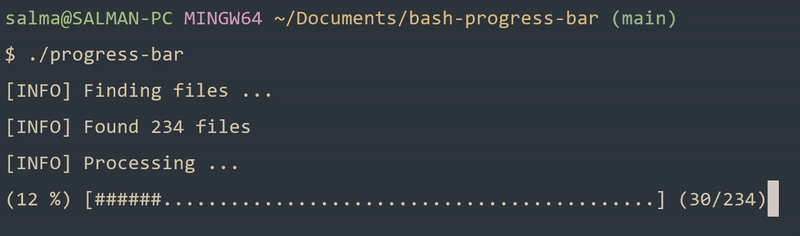

# Bash Progress Bar

A progress bar built with Bash. It helps provide feedback to the user when performing an operation over an array of files. Keep in mind that this is a rudimentary project and I mostly did it for exposure.

